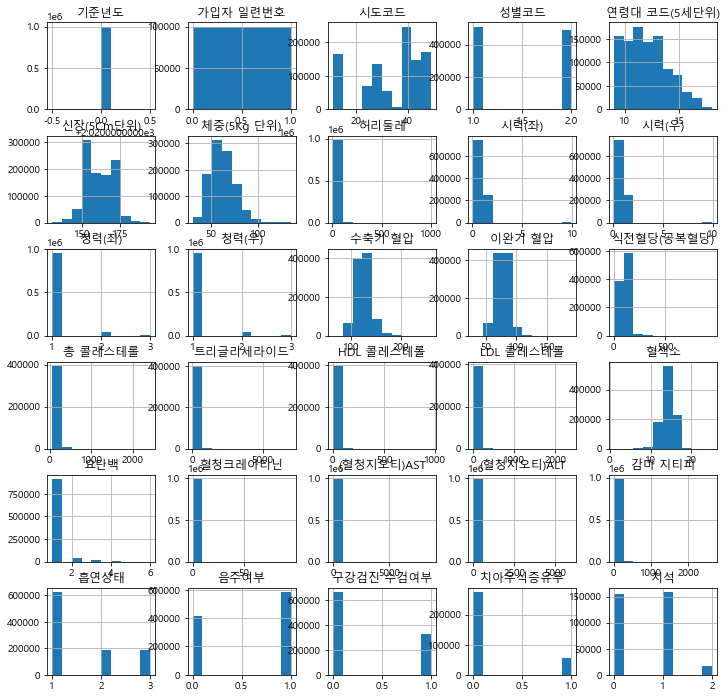
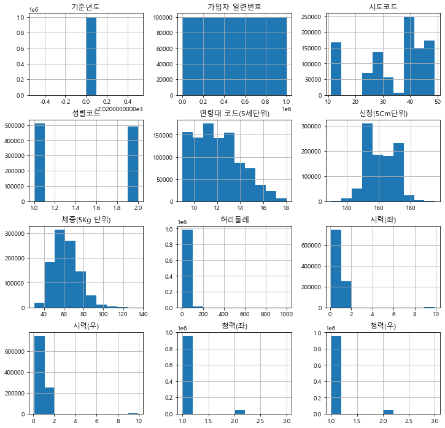
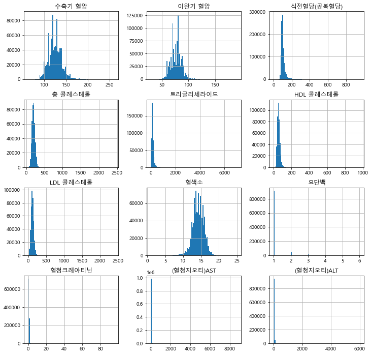

```python
import pandas as pd
import numpy as np
import seaborn as sns
import matplotlib.pyplot as plt
import os
%matplotlib inline
plt.rc('font',family = 'Malgun Gothic')
plt.rc('axes', unicode_minus = False)


%config InlneBackend.figure_format = 'retina'
```


```python
df = pd.read_csv("datatest.CSV", encoding="cp949")
df.shape
```


    (1000000, 31)


```python
df.head()
```


<div>
<style scoped>
    .dataframe tbody tr th:only-of-type {
        vertical-align: middle;
    }

    .dataframe tbody tr th {
        vertical-align: top;
    }

    .dataframe thead th {
        text-align: right;
    }
</style>
<table border="1" class="dataframe">
  <thead>
    <tr style="text-align: right;">
      <th></th>
      <th>기준년도</th>
      <th>가입자 일련번호</th>
      <th>시도코드</th>
      <th>성별코드</th>
      <th>연령대 코드(5세단위)</th>
      <th>신장(5Cm단위)</th>
      <th>체중(5Kg 단위)</th>
      <th>허리둘레</th>
      <th>시력(좌)</th>
      <th>시력(우)</th>
      <th>...</th>
      <th>혈청크레아티닌</th>
      <th>(혈청지오티)AST</th>
      <th>(혈청지오티)ALT</th>
      <th>감마 지티피</th>
      <th>흡연상태</th>
      <th>음주여부</th>
      <th>구강검진 수검여부</th>
      <th>치아우식증유무</th>
      <th>치석</th>
      <th>데이터 공개일자</th>
    </tr>
  </thead>
  <tbody>
    <tr>
      <th>0</th>
      <td>2020</td>
      <td>1</td>
      <td>36</td>
      <td>1</td>
      <td>9</td>
      <td>165</td>
      <td>60</td>
      <td>72.1</td>
      <td>1.2</td>
      <td>1.5</td>
      <td>...</td>
      <td>1.1</td>
      <td>21.0</td>
      <td>27.0</td>
      <td>21.0</td>
      <td>1.0</td>
      <td>0.0</td>
      <td>0</td>
      <td>NaN</td>
      <td>NaN</td>
      <td>2021-12-29</td>
    </tr>
    <tr>
      <th>1</th>
      <td>2020</td>
      <td>2</td>
      <td>27</td>
      <td>2</td>
      <td>13</td>
      <td>150</td>
      <td>65</td>
      <td>81.0</td>
      <td>0.8</td>
      <td>0.8</td>
      <td>...</td>
      <td>0.5</td>
      <td>18.0</td>
      <td>15.0</td>
      <td>15.0</td>
      <td>1.0</td>
      <td>0.0</td>
      <td>0</td>
      <td>NaN</td>
      <td>NaN</td>
      <td>2021-12-29</td>
    </tr>
    <tr>
      <th>2</th>
      <td>2020</td>
      <td>3</td>
      <td>11</td>
      <td>2</td>
      <td>12</td>
      <td>155</td>
      <td>55</td>
      <td>70.0</td>
      <td>0.6</td>
      <td>0.7</td>
      <td>...</td>
      <td>0.7</td>
      <td>27.0</td>
      <td>25.0</td>
      <td>7.0</td>
      <td>1.0</td>
      <td>0.0</td>
      <td>0</td>
      <td>NaN</td>
      <td>NaN</td>
      <td>2021-12-29</td>
    </tr>
    <tr>
      <th>3</th>
      <td>2020</td>
      <td>4</td>
      <td>31</td>
      <td>1</td>
      <td>13</td>
      <td>160</td>
      <td>70</td>
      <td>90.8</td>
      <td>1.0</td>
      <td>1.0</td>
      <td>...</td>
      <td>1.2</td>
      <td>65.0</td>
      <td>97.0</td>
      <td>72.0</td>
      <td>1.0</td>
      <td>0.0</td>
      <td>1</td>
      <td>0.0</td>
      <td>0.0</td>
      <td>2021-12-29</td>
    </tr>
    <tr>
      <th>4</th>
      <td>2020</td>
      <td>5</td>
      <td>41</td>
      <td>2</td>
      <td>12</td>
      <td>155</td>
      <td>50</td>
      <td>75.2</td>
      <td>1.5</td>
      <td>1.2</td>
      <td>...</td>
      <td>0.7</td>
      <td>18.0</td>
      <td>17.0</td>
      <td>14.0</td>
      <td>1.0</td>
      <td>0.0</td>
      <td>0</td>
      <td>NaN</td>
      <td>NaN</td>
      <td>2021-12-29</td>
    </tr>
  </tbody>
</table>
<p>5 rows × 31 columns</p>
</div>


```python
df.info()
```

    <class 'pandas.core.frame.DataFrame'>
    RangeIndex: 1000000 entries, 0 to 999999
    Data columns (total 31 columns):
     #   Column        Non-Null Count    Dtype  
    ---  ------        --------------    -----  
     0   기준년도          1000000 non-null  int64  
     1   가입자 일련번호      1000000 non-null  int64  
     2   시도코드          1000000 non-null  int64  
     3   성별코드          1000000 non-null  int64  
     4   연령대 코드(5세단위)  1000000 non-null  int64  
     5   신장(5Cm단위)     1000000 non-null  int64  
     6   체중(5Kg 단위)    1000000 non-null  int64  
     7   허리둘레          999892 non-null   float64
     8   시력(좌)         999743 non-null   float64
     9   시력(우)         999748 non-null   float64
     10  청력(좌)         999778 non-null   float64
     11  청력(우)         999770 non-null   float64
     12  수축기 혈압        992468 non-null   float64
     13  이완기 혈압        992466 non-null   float64
     14  식전혈당(공복혈당)    992398 non-null   float64
     15  총 콜레스테롤       402306 non-null   float64
     16  트리글리세라이드      402322 non-null   float64
     17  HDL 콜레스테롤     402315 non-null   float64
     18  LDL 콜레스테롤     394471 non-null   float64
     19  혈색소           992389 non-null   float64
     20  요단백           987859 non-null   float64
     21  혈청크레아티닌       992398 non-null   float64
     22  (혈청지오티)AST    992399 non-null   float64
     23  (혈청지오티)ALT    992398 non-null   float64
     24  감마 지티피        992397 non-null   float64
     25  흡연상태          999657 non-null   float64
     26  음주여부          999804 non-null   float64
     27  구강검진 수검여부     1000000 non-null  int64  
     28  치아우식증유무       331383 non-null   float64
     29  치석            331382 non-null   float64
     30  데이터 공개일자      1000000 non-null  object 
    dtypes: float64(22), int64(8), object(1)
    memory usage: 236.5+ MB
    


```python
# isnull 을 통해 결측치를 bool값으로 펴시 sum 하면 컬럼마다 결측치 수를 세어줌니다
df.isnull()
```


<div>
<style scoped>
    .dataframe tbody tr th:only-of-type {
        vertical-align: middle;
    }

    .dataframe tbody tr th {
        vertical-align: top;
    }

    .dataframe thead th {
        text-align: right;
    }
</style>
<table border="1" class="dataframe">
  <thead>
    <tr style="text-align: right;">
      <th></th>
      <th>기준년도</th>
      <th>가입자 일련번호</th>
      <th>시도코드</th>
      <th>성별코드</th>
      <th>연령대 코드(5세단위)</th>
      <th>신장(5Cm단위)</th>
      <th>체중(5Kg 단위)</th>
      <th>허리둘레</th>
      <th>시력(좌)</th>
      <th>시력(우)</th>
      <th>...</th>
      <th>혈청크레아티닌</th>
      <th>(혈청지오티)AST</th>
      <th>(혈청지오티)ALT</th>
      <th>감마 지티피</th>
      <th>흡연상태</th>
      <th>음주여부</th>
      <th>구강검진 수검여부</th>
      <th>치아우식증유무</th>
      <th>치석</th>
      <th>데이터 공개일자</th>
    </tr>
  </thead>
  <tbody>
    <tr>
      <th>0</th>
      <td>False</td>
      <td>False</td>
      <td>False</td>
      <td>False</td>
      <td>False</td>
      <td>False</td>
      <td>False</td>
      <td>False</td>
      <td>False</td>
      <td>False</td>
      <td>...</td>
      <td>False</td>
      <td>False</td>
      <td>False</td>
      <td>False</td>
      <td>False</td>
      <td>False</td>
      <td>False</td>
      <td>True</td>
      <td>True</td>
      <td>False</td>
    </tr>
    <tr>
      <th>1</th>
      <td>False</td>
      <td>False</td>
      <td>False</td>
      <td>False</td>
      <td>False</td>
      <td>False</td>
      <td>False</td>
      <td>False</td>
      <td>False</td>
      <td>False</td>
      <td>...</td>
      <td>False</td>
      <td>False</td>
      <td>False</td>
      <td>False</td>
      <td>False</td>
      <td>False</td>
      <td>False</td>
      <td>True</td>
      <td>True</td>
      <td>False</td>
    </tr>
    <tr>
      <th>2</th>
      <td>False</td>
      <td>False</td>
      <td>False</td>
      <td>False</td>
      <td>False</td>
      <td>False</td>
      <td>False</td>
      <td>False</td>
      <td>False</td>
      <td>False</td>
      <td>...</td>
      <td>False</td>
      <td>False</td>
      <td>False</td>
      <td>False</td>
      <td>False</td>
      <td>False</td>
      <td>False</td>
      <td>True</td>
      <td>True</td>
      <td>False</td>
    </tr>
    <tr>
      <th>3</th>
      <td>False</td>
      <td>False</td>
      <td>False</td>
      <td>False</td>
      <td>False</td>
      <td>False</td>
      <td>False</td>
      <td>False</td>
      <td>False</td>
      <td>False</td>
      <td>...</td>
      <td>False</td>
      <td>False</td>
      <td>False</td>
      <td>False</td>
      <td>False</td>
      <td>False</td>
      <td>False</td>
      <td>False</td>
      <td>False</td>
      <td>False</td>
    </tr>
    <tr>
      <th>4</th>
      <td>False</td>
      <td>False</td>
      <td>False</td>
      <td>False</td>
      <td>False</td>
      <td>False</td>
      <td>False</td>
      <td>False</td>
      <td>False</td>
      <td>False</td>
      <td>...</td>
      <td>False</td>
      <td>False</td>
      <td>False</td>
      <td>False</td>
      <td>False</td>
      <td>False</td>
      <td>False</td>
      <td>True</td>
      <td>True</td>
      <td>False</td>
    </tr>
    <tr>
      <th>...</th>
      <td>...</td>
      <td>...</td>
      <td>...</td>
      <td>...</td>
      <td>...</td>
      <td>...</td>
      <td>...</td>
      <td>...</td>
      <td>...</td>
      <td>...</td>
      <td>...</td>
      <td>...</td>
      <td>...</td>
      <td>...</td>
      <td>...</td>
      <td>...</td>
      <td>...</td>
      <td>...</td>
      <td>...</td>
      <td>...</td>
      <td>...</td>
    </tr>
    <tr>
      <th>999995</th>
      <td>False</td>
      <td>False</td>
      <td>False</td>
      <td>False</td>
      <td>False</td>
      <td>False</td>
      <td>False</td>
      <td>False</td>
      <td>False</td>
      <td>False</td>
      <td>...</td>
      <td>False</td>
      <td>False</td>
      <td>False</td>
      <td>False</td>
      <td>False</td>
      <td>False</td>
      <td>False</td>
      <td>True</td>
      <td>True</td>
      <td>False</td>
    </tr>
    <tr>
      <th>999996</th>
      <td>False</td>
      <td>False</td>
      <td>False</td>
      <td>False</td>
      <td>False</td>
      <td>False</td>
      <td>False</td>
      <td>False</td>
      <td>False</td>
      <td>False</td>
      <td>...</td>
      <td>False</td>
      <td>False</td>
      <td>False</td>
      <td>False</td>
      <td>False</td>
      <td>False</td>
      <td>False</td>
      <td>True</td>
      <td>True</td>
      <td>False</td>
    </tr>
    <tr>
      <th>999997</th>
      <td>False</td>
      <td>False</td>
      <td>False</td>
      <td>False</td>
      <td>False</td>
      <td>False</td>
      <td>False</td>
      <td>False</td>
      <td>False</td>
      <td>False</td>
      <td>...</td>
      <td>False</td>
      <td>False</td>
      <td>False</td>
      <td>False</td>
      <td>False</td>
      <td>False</td>
      <td>False</td>
      <td>True</td>
      <td>True</td>
      <td>False</td>
    </tr>
    <tr>
      <th>999998</th>
      <td>False</td>
      <td>False</td>
      <td>False</td>
      <td>False</td>
      <td>False</td>
      <td>False</td>
      <td>False</td>
      <td>False</td>
      <td>False</td>
      <td>False</td>
      <td>...</td>
      <td>False</td>
      <td>False</td>
      <td>False</td>
      <td>False</td>
      <td>False</td>
      <td>False</td>
      <td>False</td>
      <td>True</td>
      <td>True</td>
      <td>False</td>
    </tr>
    <tr>
      <th>999999</th>
      <td>False</td>
      <td>False</td>
      <td>False</td>
      <td>False</td>
      <td>False</td>
      <td>False</td>
      <td>False</td>
      <td>False</td>
      <td>False</td>
      <td>False</td>
      <td>...</td>
      <td>False</td>
      <td>False</td>
      <td>False</td>
      <td>False</td>
      <td>False</td>
      <td>False</td>
      <td>False</td>
      <td>True</td>
      <td>True</td>
      <td>False</td>
    </tr>
  </tbody>
</table>
<p>1000000 rows × 31 columns</p>
</div>


```python
df.isna().sum()
```


    기준년도                 0
    가입자 일련번호             0
    시도코드                 0
    성별코드                 0
    연령대 코드(5세단위)         0
    신장(5Cm단위)            0
    체중(5Kg 단위)           0
    허리둘레               108
    시력(좌)              257
    시력(우)              252
    청력(좌)              222
    청력(우)              230
    수축기 혈압            7532
    이완기 혈압            7534
    식전혈당(공복혈당)        7602
    총 콜레스테롤         597694
    트리글리세라이드        597678
    HDL 콜레스테롤       597685
    LDL 콜레스테롤       605529
    혈색소               7611
    요단백              12141
    혈청크레아티닌           7602
    (혈청지오티)AST        7601
    (혈청지오티)ALT        7602
    감마 지티피            7603
    흡연상태               343
    음주여부               196
    구강검진 수검여부            0
    치아우식증유무         668617
    치석              668618
    데이터 공개일자             0
    dtype: int64


```python
df.isnull().sum().plot.barh(figsize=(10, 9))
# 판다스에 내장된 piotf를 통해 시각화생성
```


    <AxesSubplot:>


    

    


```python
# 전체데이터 히스토그램 출력
h =df.hist(figsize=(12,12))
```


    

    


```python
#슬라이싱 사용해서 12개컬럼에 대한 데이터로 히스토그램을 그립니다
#[행,열]
h = df.iloc[:,:12].hist(figsize=(12,12))
```


    

    


```python
# 슬라이싱을 사용해 앞에서 12번쨰 23번째까지(12:24) 컬럼에대한 데이터로 히스토그램을 그립니다
h =df.iloc[:,12:24].hist(figsize=(12,12),bins=100)
```


    

    


```python

```


```python

```
